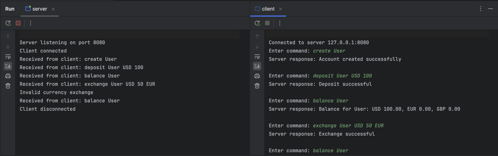
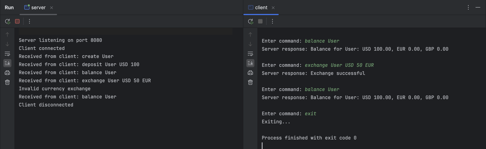

# CURRENCY EXCHANGE SYSTEM
This is a client-server program that simulates the operation of a currency exchange system

# DESCREPTION

The aim of this project was to create a **TCP/IP client-server** application in the **C programming language**, which **simulates the operation of a currency exchange system**. In this system, the server acts as _the currency exchange platform_, and the client is able _to perform transactions involving the exchange of different currencies_. The communication between the server and clients will be handled using _internet stream sockets_.

**Currency Exchange Rates:** The server **will maintain exchange rates for a predefined set of currencies**. The exchange rates between these currencies can be defined arbitrarily for the purpose of the implementation.

**Client Accounts:** The server will store and manage the accounts of each client, tracking the available balance in different currencies for each client. Furthermore, client data will be saved to a file, allowing account details to be restored when a client reconnects to the system.

**Client Operations:** Clients will be able **to register or log into the system**. They will have the ability to create accounts, deposit money into those accounts in different currencies, withdraw money from their accounts, and perform currency exchanges using the funds available in their accounts.

## FILES

Begin by **downloading the server.c file and the clients.c file**. After downloading the files,you can run the files in the command window or your prefered IDE._After running the server.c you have to run the client.c_.When you exit the programm , two .dat files will be created with the info of the accounts and the clients that the user made.

## COMMANDS

**-create <username>:**
  This command is used to create a new user account with the specified username.
    Example: create john
    
**-deposit <username> USD/EUR/GBP <amount>:**
  This command allows the user to deposit a specified amount of money in a specific currency (USD, EUR, or GBP) into their account.
    Example: deposit john USD 100.50
    
**-balance <username>:**
  This command retrieves and displays the current balance for all currencies in the specified user's account.
    Example: balance john
    
**-exchange <username> USD/EUR/GBP (from) <amount> USD/EUR/GBP (to):**
  This command allows the user to exchange a specified amount from one currency to another (USD, EUR, or GBP), based on the current    exchange rates maintained by the server.
   Example: exchange john USD 100 EUR
   
**-exit:**
  This command allows the user to disconnect from the system.

## SCREENSHOTS 

